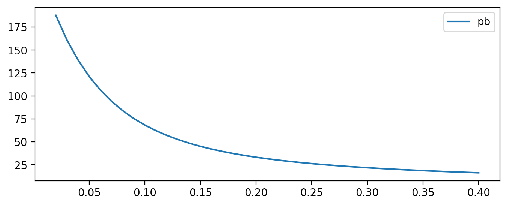
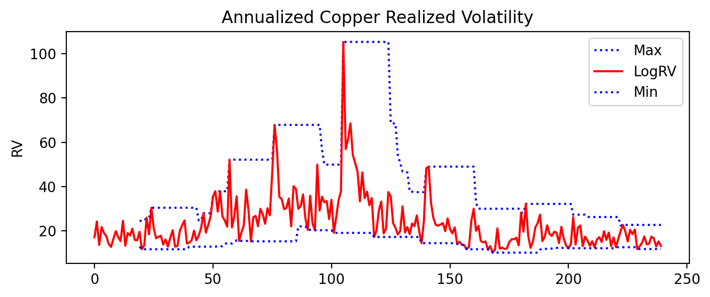

---
header-includes:
  - \usepackage[english]{babel}
  - \usepackage{svg}
title: |
  {width=0.45in}  
  ENGIN 604 Introduction to Python for Finance — Fall 2021
author: "Final Exam - Solution"
due: "10:50am, Thursday, April 22"
submit: "engin604assignments@gmail.com"
page: '$\infty$ pages'
link-citations: yes
citecolor: blue
urlcolor: blue
linkcolor: blue
geometry: margin=0.75in
fontsize: 10pt
output:
  bookdown::pdf_document2:
    toc: no
    highlight: "default"
    number_sections: no
    fig_caption: yes
    dev: cairo_pdf
    latex_engine: pdflatex
    template: "Latex/template.tex"
---

```{r setup, include=FALSE}
knitr::opts_chunk$set(echo = TRUE)
```

\begin{center}
\textbf{Instructions}
\end{center}

- The exam is **INDIVIDUAL**.

- You have from 9:30 am until 10:50 am (1 hour and 20 minutes) on Thursday, April 22, 2021 to work on and submit the exam.

- You must develop the exam in **A SINGLE Python SCRIPT** with extension **.py** and send it to <engin604assignments@gmail.com> before 10:50 am on Thursday, April 22, 2021. Any email sent after the deadline will be graded 1.0.

- The file name must be `Ex_RUT without dots or hyphen.py`. Example: if your RUT is `12.345.678-9`, the file name must be `Ex_123456789.py`.

- The email subject must be `Final Exam + RUT without dots or hyphen`. Example: if your RUT is `12.345.678-9`, the email subject must be `Final Exam 123456789`.

- Any question that involves a written answer must be answered as a comment in the **.py** file.

- If you have any doubt regarding the development of your exam, you may state your assumption as a comment in the **.py** file, whose relevance will be assessed at grading time. If you have any problem during the development of your exam, you may join the following Webex room: <https://fenuchile.webex.com/meet/gcabrerag>.

- **ONLY** the statements and solutions of the **GUIDES**, **HOMEWORK** and **TUTORIALS** may be used as support during the exam.

- Any sign of copying will be graded 1.0 and the actions stipulated in the **ZERO TOLERANCE FOR COPYING** rules of the Graduate School will be taken.

\newpage

# Questions

1. (10 points) A prime number is one that is only divisible by itself and the number 1. For example, the number 11 is a prime number because it is only divisible by 11 and by 1. In a list, show the prime numbers that exist between 1 and 100 (do not consider 1 as a prime number).

    ```{python, eval=FALSE}
    # list of numbers from 1 to 100
    num1 = list(range(1,101))

    # empty list
    prime_numbers = []

    # loop
    for i in num1:
        if i > 1:
            num2 = []
            for j in range(2,i+1):
                if i % j == 0:
                    num2.append(j)
            if len(num2) == 1:
                prime_numbers.append(i)
    ```

2. A bullet bond is one in which the issuer pays the bondholder coupons (interest payments) corresponding to each period and, at maturity (last period), the holder receives the coupon plus the principal (the face value of the bond). The mathematical formula would be:

    $$
    P_B = \sum^{T-1}_{t=1} \frac{C}{(1+r)^t} + \frac{C + \text{Face Value}}{(1+r)^T}
    $$

    Where $P_B$ is the bond price, $C$ the interest or coupon payment, $T$ the number of periods and $r$ the discount rate.

    a. (10 points) Generate an *array* containing a sequence of numbers from 0.02 to 0.4 (40 elements) where the distance between each number is 0.01.

        ```{python, eval=FALSE}
        # numpy is loaded
        import numpy as np

        # the array is created
        num3 = np.array(list(range(2,41))) / 100
        ```

    b. (10 points) Using each element of the *array* generated in (a) as the discount rate ($r$), compute and store in a list the price of the bullet bond ($P_B$). Except for the discount rate ($r$), keep the following parameters constant:

        Table: Bullet Bond Parameters

        | Parameter  | Value    |
        |------------|----------|
        | $T$        | 25 years |
        | $C$        | 0.065    |
        | Face Value | 100      |

        The coupon payments are annual.

        ```{python, eval=FALSE}
        def bullet_bond_price(fv, t, cr, r):
            """
            Parameters
            ----------
            fv : Face value of the bullet bond (float).
            t : Number of periods (float).
            cr : Coupon interest rate (float).
            r : Discount rate (float).
            Returns
            -------
            Price of a bullet bond.
            """
            pb = 0

            for i in range(1,t+1):
                if i == t:
                    pb += (fv * cr + fv) / (1 + r) ** i
                else:
                    pb += (fv * cr) / (1 + r) ** i

            return(pb)

        # empty list
        pb_k_list = []

        # the bond price is computed and stored in a loop
        for k in num3:
            pb_k = bullet_bond_price(100, 25, 0.065, k)
            pb_k_list.append(pb_k)
        ```

    c. (10 points) Plot the relationship between the bullet bond price ($P_B$) and the risk-free rate ($r$). What do you observe?

        ```{python, eval=FALSE}
        # pandas is loaded
        import pandas as pd

        # the DataFrame is created
        df1 = pd.DataFrame(data = {'pb':pb_k_list}, index = num3)

        # it is plotted
        df1.plot(figsize=(8,3))
        ```

        {width=75%}

3. The monthly realized volatility of copper for month $m$ is built as the square root of the sum of the squared daily log returns:

    $$
    RV_t = \sqrt{\sum^{M_t}_{j=1} r^2_{j,t}}
    $$

    Where $M_t$ is the total number of business days in month $m$.

    a. (5 points) The file `copper_daily.xlsx` contains two sheets:

        i. `copper`: daily *spot* price of copper (`icopper`) from 2000-01-03 to 2019-12-31 (`date`).

        ii. `recession`: monthly business cycle of China (`chrec`) from 2000-01 to 2019-12 (`year` and `month`). 1 implies recession and 0 expansion.

        Load the data into your workspace and compute the monthly realized volatility for copper. Remember to drop the `NAs` that arise when creating the log returns.

        ```{python, eval=FALSE}
        # loads the sheet with the daily price of copper in dollars
        copper_daily = pd.read_excel('copper_daily.xlsx', sheet_name='copper')

        # the date is added to the index
        copper_daily.set_index('date', inplace=True)

        # the log return is computed
        copper_daily['logret'] = copper_daily.apply(lambda x: np.log(x / x.shift(1)))
        # the na is dropped
        copper_daily.dropna(inplace=True)

        # the year column is created
        copper_daily['year'] = copper_daily.index.year
        # the month column is created
        copper_daily['month'] = copper_daily.index.month

        # the variable containing the copper price is dropped
        copper_daily.drop(columns=['icopper'], axis=1, inplace=True)

        # it is grouped by year and month, the squared return is computed and
        # summed, creating one observation per month
        copper_daily = copper_daily.groupby(['year', 'month'])['logret'].\
                                    apply(lambda x: np.sqrt(np.sum(x ** 2)))

        # it is turned into a DataFrame and then the index (year and date)
        # becomes a variable
        rv_copper = copper_daily.to_frame().reset_index()

        # the variable is renamed
        rv_copper.rename(columns={'logret':'log_rv_copper'}, inplace=True)
        ```

    b. (5 points) Merge the monthly realized volatility computed in (a) with the `rec` variable from the `recession` sheet.

        ```{python, eval=FALSE}
        # loads the sheet with the recessions
        rec = pd.read_excel('copper_daily.xlsx', sheet_name='recession')

        # the recession is merged with the price through a merge
        rv_copper_with_rec = rv_copper.merge(rec, on=['year', 'month'])
        ```

    c. (10 points) Annualize^[To annualize you must multiply by $\sqrt{12}$.] the monthly realized volatility created in (a) and then plot it, adding the 20-day rolling minimum and maximum (also of the annualized realized volatility). The expected result is the following:

        ```{python, eval=FALSE}
        # matplotlib is imported
        import matplotlib.pyplot as plt

        # variables are created
        rv_copper_with_rec2 = rv_copper_with_rec.copy()
        rv_copper_with_rec2['LogRV'] = rv_copper_with_rec2['log_rv_copper'].\
                                       apply(lambda x: x * np.sqrt(12) * 100)
        rv_copper_with_rec2['Min'] = rv_copper_with_rec2['LogRV'].rolling(20).min()
        rv_copper_with_rec2['Max'] = rv_copper_with_rec2['LogRV'].rolling(20).max()

        # the annualized realized volatility is plotted
        rv_copper_with_rec2.loc[:,['Max','LogRV','Min']].plot(figsize=(8,3),
                                                              style=['b:','r-','b:'])
        plt.title("Annualized Copper Realized Volatility")
        plt.ylabel("RV")
        ```

        {width=75%}

    d. (10 points) Compute the descriptive statistics^[You must only include mean, standard deviation, minimum value and maximum value.] of the monthly realized volatility for the periods where:

        i. China was in recession (`rec = 1`)

            ```{python, eval=FALSE}
            # it is filtered by chrec == 0 and the descriptive statistics
            # of the realized volatility are computed
            rv_copper_with_rec[rv_copper_with_rec['chrec']==0].loc[:,'log_rv_copper'].\
                                                               describe()[['mean','std',
                                                                           'min','max']]
            ```

        ii. China was in expansion (`rec = 0`)

            ```{python, eval=FALSE}
            # it is filtered by chrec == 1 and the descriptive statistics
            # of the realized volatility are computed
            rv_copper_with_rec[rv_copper_with_rec['chrec']==1].loc[:,'log_rv_copper'].\
                                                               describe()[['mean','std',
                                                                           'min','max']]
            ```
